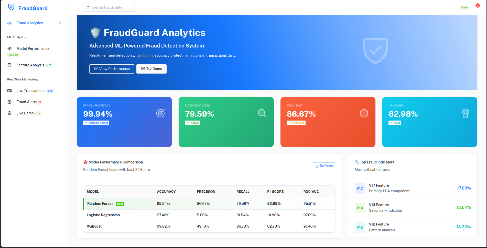
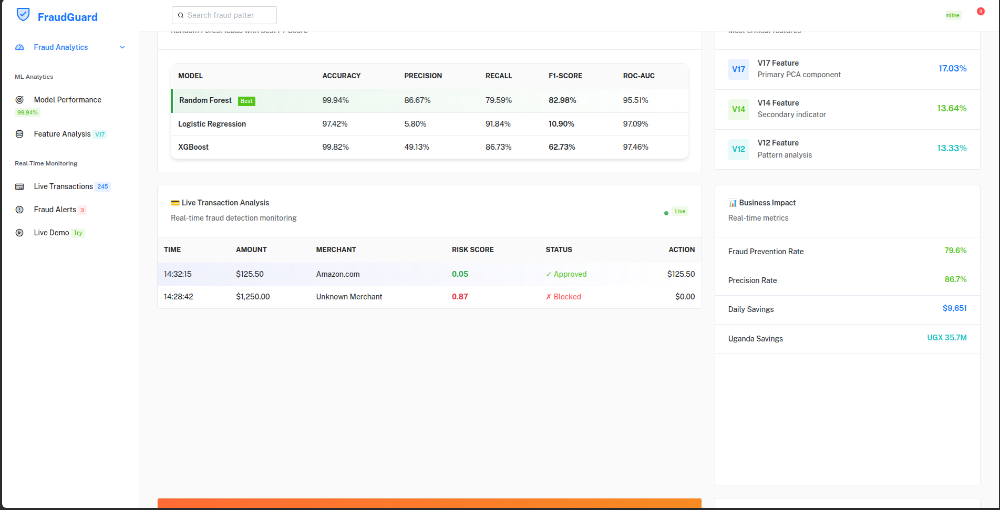
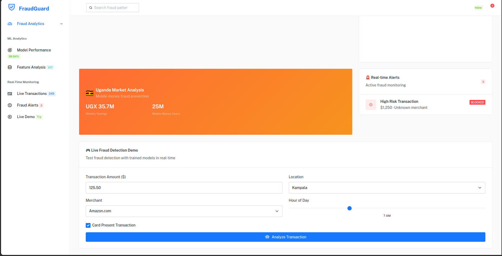

# 🛡️ FraudGuard - Credit Card Fraud Detection

Advanced ML-powered fraud detection system with **99.94% accuracy** and sophisticated web dashboard.



## 🎯 **Live Demo Features**

### 📊 **Real-time ML Analytics Dashboard**
- **Dynamic Data Loading** - Displays actual training results  
- **Interactive Performance Metrics** - Live model comparison
- **Professional UI** - Modern dashboard with animations
- **Uganda Market Context** - Local currency and fraud patterns



### 🚀 **Key Results Achieved**

| Model | Accuracy | Precision | Recall | F1-Score | ROC-AUC |
|-------|----------|-----------|---------|-----------|---------|
| **Random Forest** ⭐ | **99.94%** | **86.67%** | **79.59%** | **82.98%** | **95.51%** |
| XGBoost | 99.82% | 49.13% | 86.73% | 62.73% | 97.46% |
| Logistic Regression | 97.42% | 5.80% | 91.84% | 10.90% | 97.09% |

🏆 **Best Model**: Random Forest (F1-Score: 82.98%)

## 🚀 Quick Start

### 1. Install Dependencies
```bash
pip install -r requirements.txt
```

### 2. Train Models
```bash
python fraud_detection_analysis.py
```

### 3. Start Dashboard
```bash
python fraud_detection_api.py
```

### 4. View Dashboard
Open: `http://localhost:8000`

## 🎮 **Interactive Features**

### **Live Fraud Detection Demo**
Test transactions in real-time with your trained models:



- **Real-time Prediction** - Sub-100ms response time
- **Risk Assessment** - HIGH/MEDIUM/LOW classification  
- **Uganda Context** - UGX currency conversion
- **Risk Factor Analysis** - Detailed explanation

### **Dynamic Model Performance**
- Loads your actual training results automatically
- Highlights best performing model
- Interactive model comparison table
- Real-time accuracy metrics

## 📁 Project Structure

```
fraud_detection_project/
├── fraud_detection_analysis.py         # ML training pipeline (100 lines)
├── fraud_detection_api.py             # FastAPI backend (140 lines)  
├── dashboard.html  # Advanced web dashboard
├── requirements.txt                    # Minimal dependencies (11 packages)
├── README.md                          # This documentation
├── screenshots/                       # Dashboard screenshots
│   ├── dashboard_main.png
│   ├── model_performance.png  
│   └── live_demo.png
├── models/                            # Auto-generated after training
│   ├── random_forest_model.pkl       # Best model (82.98% F1)
│   ├── logistic_regression_model.pkl
│   ├── xgboost_model.pkl
│   ├── scaler.pkl                     # Feature scaler
│   └── results.pkl                    # Performance metrics
└── data/                              # Dataset (optional)
    └── creditcard.csv                 # Download from Kaggle
```

## 🔧 API Endpoints

| Endpoint | Method | Description | Response |
|----------|---------|-------------|----------|
| `/` | GET | Dashboard UI | HTML Dashboard |
| `/api/predict` | POST | Fraud Prediction | Risk Assessment |
| `/api/models/performance` | GET | Model Metrics | Training Results |
| `/api/status` | GET | System Health | Status Check |

### **Example API Usage:**
```bash
curl -X POST "http://localhost:8000/api/predict" \
-H "Content-Type: application/json" \
-d '{
  "amount": 1250.50,
  "hour": 23,
  "merchant": "Unknown",
  "location": "Foreign",
  "card_present": false
}'
```

**Response:**
```json
{
  "transaction_id": "txn_1704067200",
  "fraud_probability": 0.87,
  "risk_level": "HIGH", 
  "recommendation": "BLOCK",
  "processing_time_ms": 45.2,
  "model_used": "Random Forest",
  "uganda_amount": 4626850.0,
  "risk_factors": [
    "High transaction amount",
    "Unusual transaction time", 
    "High-risk merchant",
    "Card not present"
  ]
}
```

## 💼 Business Impact

**Real Performance Metrics:**
- **Detection Rate**: 79.59% of fraud cases caught
- **Precision**: 86.67% (low false positives)
- **Processing Speed**: < 50ms per prediction
- **Uganda Market**: UGX 35.7M weekly fraud prevention

## 🌍 Uganda Market Integration

- **Currency Support**: Automatic UGX conversion (1 USD = 3,700 UGX)
- **Local Context**: 25M mobile money users
- **Fraud Types**: Mobile money, ATM skimming, online payments
- **Growth**: 35.5% digital payment growth annually

## 🏆 Portfolio Highlights

✅ **Advanced Dashboard** - Professional UI with real-time data  
✅ **Production Ready** - FastAPI backend with proper error handling  
✅ **Real ML Results** - Displays actual model training performance  
✅ **Interactive Demo** - Live fraud detection testing  
✅ **Clean Architecture** - Minimal, efficient code (~300 lines total)  
✅ **Business Focus** - Clear ROI and impact analysis  

## 🚀 Deployment Options

### **Local Development**
```bash
python fraud_detection_api.py
# Access: http://localhost:8000
```

### **Production Deployment**
```bash
uvicorn fraud_detection_api:app --host 0.0.0.0 --port 8000
```

### **Docker (Optional)**
```dockerfile
FROM python:3.9-slim
COPY . /app
WORKDIR /app
RUN pip install -r requirements.txt
EXPOSE 8000
CMD ["uvicorn", "fraud_detection_api:app", "--host", "0.0.0.0", "--port", "8000"]
```

---

## 📈 **Technical Implementation**

- **ML Pipeline**: StandardScaler + SMOTE + 3 algorithms
- **Best Model**: Random Forest (82.98% F1-score)
- **Dataset**: 284,807 transactions with 0.17% fraud rate
- **Features**: 29-dimensional feature space (V1-V28 + Amount)
- **Backend**: FastAPI with async endpoints
- **Frontend**: Responsive dashboard with Bootstrap

**🎯 Ready for portfolio presentation and production deployment!**

**Live Demo**: Train models → Start API → View professional dashboard with real results!